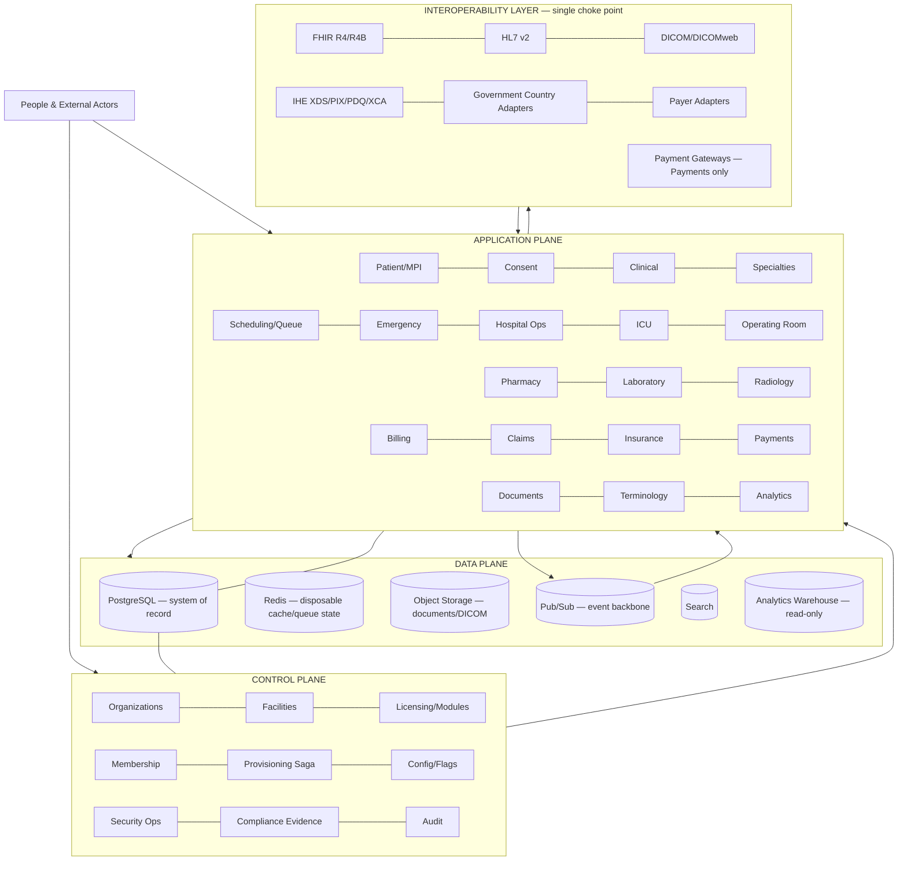
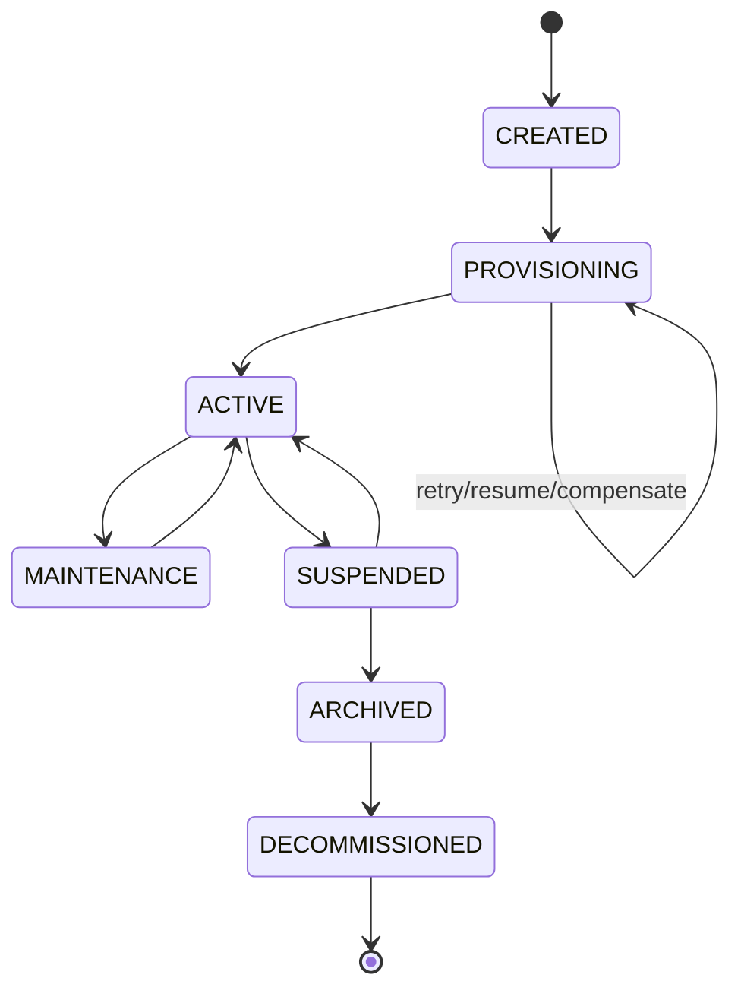
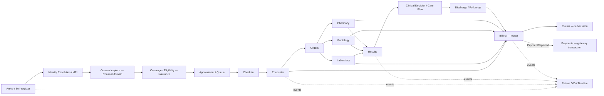
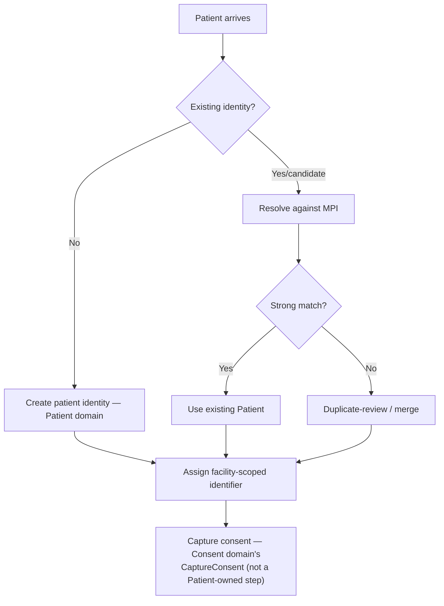
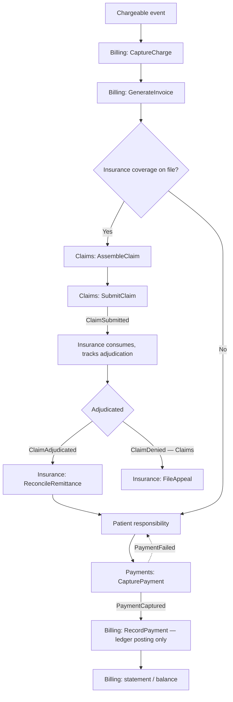
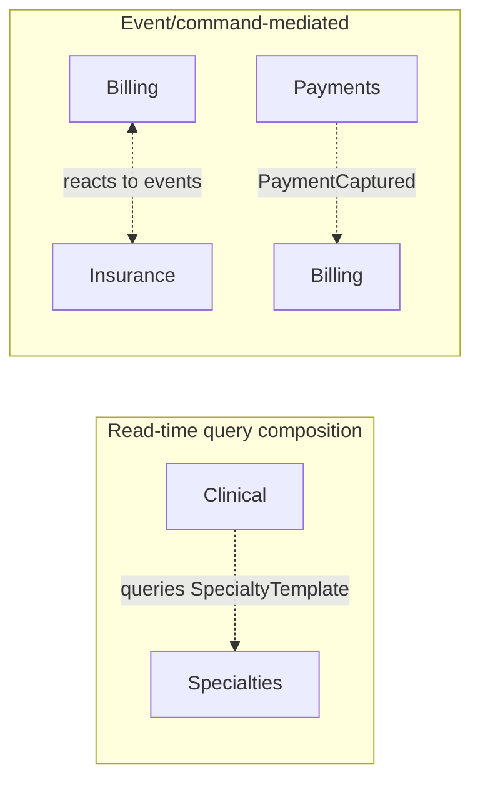

# ARGON Health Platform — Master System Flow & Lifecycle Blueprint

STATUS: DETAILED VISUAL/NAVIGATION REFERENCE — reflects the frozen
ACR-1..5 resolution (ADR-021, ADR-022, ADR-023) and the ADR-014
governance sync. This document is a SYNTHESIS, not a source of truth.

CANONICAL BASIS: `ARGON-HEALTH`, commit
`50d50f74488cbdf5c5590a0f4a1e96c5bc168e34`.

UMBRELLA DOCUMENT: `docs/MASTER-ARGON-BLUEPRINT.md` remains the
navigation/synthesis umbrella for the full architecture (Security,
Compliance, Clinical Safety, Infrastructure, DR, Testing, Tech Stack,
Roadmap, Risks, Open Decisions). This document is its detailed
operational/flow companion — every section below is self-contained;
none defers to a document outside this repository.

CURRENT STATE: TARGET ARCHITECTURE / PROPOSED. No implementation
exists. Current production remains the legacy ARGON Medical OS
(Firebase-based).

HIERARCHY — per `docs/governance/ARGON-SOURCE-OF-TRUTH.md`'s actual
precedence order (restated here, not redefined):
1. Executable evidence
2. Approved ADR (Status: APPROVED — none exist yet; ADR-014, ADR-019,
   ADR-020, ADR-021, ADR-022, ADR-023 are all currently PROPOSED)
3. Master Architecture (`docs/master/01`–`20` **and**
   `docs/MASTER-ARGON-BLUEPRINT.md` — this document is that Blueprint's
   detailed companion and sits alongside it at this same tier; neither
   ever overrides `docs/master/01`–`20` itself)
4. Detailed design
5. Informational documentation (`docs/evidence/`, `docs/audit/`, README)
6. Conversation / history

## Note on source file names

Built from the actual current file names in `docs/master/`, verified
directly rather than assumed:

| Topic | Actual current file |
|---|---|
| Security/authorization model | `07-MASTER-SECURITY-MAP.md` |
| Compliance model | `08-MASTER-COMPLIANCE-MAP.md` |
| Control plane / tenant lifecycle | `09-MASTER-CONTROL-PLANE.md` |
| Patient journey | `10-MASTER-PATIENT-JOURNEY.md` |
| Organization/facility provisioning | `11-MASTER-ORGANIZATION-PROVISIONING.md` |

No file named `07-MASTER-SECURITY-ARCHITECTURE.md`, `08-MASTER-NFR-MAP.md`,
`09-MASTER-TENANCY-MAP.md`, `10-MASTER-PATIENT-JOURNEY-MAP.md`, or
`11-MASTER-ORGANIZATION-LIFECYCLE-MAP.md` exists in this repository.

---

# 1. FROZEN ACR BOUNDARIES

### ACR-1 — Consent
```text
CONSENT domain  → sole owner of the consent WRITE lifecycle
                  (CaptureConsent, WithdrawConsent →
                   ConsentGranted, ConsentWithdrawn)
PATIENT domain  → identity / MPI / Patient 360 only.
                  Read-side delegation via GetConsentStatus.
```

### ACR-2 — Claims
```text
CLAIMS domain     → owns claim SUBMISSION (Claim, AssembleClaim →
                     SubmitClaim → ClaimSubmitted, ClaimDenied, ClaimPaid)
INSURANCE domain  → retains eligibility, authorization,
                     ADJUDICATION (ClaimAdjudicated), remittance, appeals.
```

### ACR-3 — Dependency semantics (not an ownership change)
```text
Clinical ↔ Specialties  = read-time query/composition dependency
Billing ↔ Insurance     = event/command-mediated side-effect interaction
```

### ACR-4 — Procurement
```text
Exactly 30 workflows. No Workflow #31.
Procurement is fully specified in 03, referenced by name in 05's Scope
section only — no dedicated workflow slot.
```

### ACR-5 — Payments
```text
PAYMENTS domain  → PaymentTransaction, RefundTransaction, gateway,
                    idempotency, tokenization.
BILLING domain   → Payment = ledger/accounting posting record only.
PaymentTransaction ≠ Payment
```
```text
PAYMENTS → PaymentCaptured → BILLING → RecordPayment (ledger posting)
```
**Open, explicitly undecided:** `RefundTransaction`/`IssueRefund`/
`RefundIssued` (Payments) ≠ `CreditNote`/`IssueCreditNote`/
`CreditNoteIssued` (Billing). ADR-023 states neither implies the
other — not resolved here, no mapping invented.

*(Traceability: `03`, `19` ADR-021/022/023)*

---

# 2. The whole platform in one picture



### Architectural rules represented
1. **Control Plane** manages platform state; never reads clinical
   content directly.
2. **Application Plane** owns clinical/operational behavior — Consent,
   Claims, and Payments appear as explicit peers to Patient, Insurance,
   and Billing (ACR-1/2/5), not folded into them.
3. **Data Plane**: PostgreSQL is the single source of structural truth;
   every other store is cache, binary blob, or derived read model —
   never a second source of truth for the same fact (`04`).
4. **Interoperability Layer** is the single choke point — no domain
   talks to an external system directly (`06`). Payment gateways are
   reached only through Payments (ACR-5).
5. Multi-tenancy is a platform-wide invariant, enforced at application
   layer and PostgreSQL RLS (`07`).

*(Traceability: `01`, `02`, `03`, `04`, `06`, `07`, `09`)*

---

# 3. Organization model and provisioning saga

```text
Organization
  ├── Facilities
  │    ├── Departments → Units → operational resources
  │    └── facility-specific modules/capabilities
  ├── License Tier · Module Entitlements · Membership/Admins
  └── Policies / configuration context
```

### Provisioning saga (`11`)
```text
CREATE → VALIDATE → COUNTRY PROFILE → TEMPLATE → STRUCTURE → MODULES
  → LICENSE → POLICIES → ADMINS → INTEGRATIONS → SECURITY BASELINE
  → PROVISIONING → VALIDATION → HEALTH CHECK → READY → ACTIVATE
```

| Step | What happens | Owning domain |
|---|---|---|
| CREATE | Organization record created, lifecycle = CREATED | Organization |
| VALIDATE | Input completeness/consistency check | Control Plane |
| COUNTRY PROFILE | Attach country adapter (residency, e-invoicing, local codes) | Government Integrations, `06` |
| TEMPLATE | Select facility-type template | Organization |
| STRUCTURE | Instantiate facility structure per template | Organization, Hospital |
| MODULES | Attach entitled modules per license tier | Organization, Control Plane |
| LICENSE | Set license tier, seat/usage limits | Organization |
| POLICIES | Apply security/retention/compliance defaults | Compliance, Security |
| ADMINS | Provision initial admin user(s) | Identity, Membership |
| INTEGRATIONS | Configure entitled integrations | Interoperability |
| SECURITY BASELINE | Apply RLS policies, default roles, MFA requirement | Security |
| PROVISIONING | Execute as tracked, resumable steps | Control Plane |
| VALIDATION | Re-check provisioned state against template | Control Plane |
| HEALTH CHECK | Confirm every entitled module responds healthy | Observability |
| READY | All checks passed | Control Plane |
| ACTIVATE | Lifecycle = ACTIVE, tenant usable | Control Plane, Organization |

**Saga guarantees:** idempotent re-run, retry-with-backoff on transient
failure, per-step audit trail, failure triggers compensation for every
already-completed step (never a half-created org left silently active),
preview-before-execution, dependency validation (e.g. MODULES cannot
exceed LICENSE), bulk provisioning as independently-compensable
instances, and template cloning/versioning (an org's provisioning
record pins the exact template version resolved at CREATE time — a
later template edit never silently re-applies).

**Example — Hospital template** instantiates Campus → Buildings →
Departments → Units → Wards → Rooms → Beds, plus ICU, Emergency,
Operating Room(s), facility-scoped Pharmacy/Laboratory/Radiology,
Billing/Insurance configuration, initial users/roles, policies, and
integrations. A **Clinic** template runs the same saga with a minimal
STRUCTURE (no Campus/Wards/ICU/OR).

**Explicit non-scope:** reaching ACTIVATE means the digital
organization is provisioned. It does **not** mean legal business
licensing, physical facility inspection, or government regulatory
approval is complete — those are external, tracked separately, never
inferred from software state.

*(Traceability: `03` ORGANIZATION, `11`)*

---

# 4. Organization lifecycle state machine



| State | Meaning |
|---|---|
| `CREATED` | Record exists; provisioning not started |
| `PROVISIONING` | Saga running; not yet usable clinically |
| `ACTIVE` | Normal operating state |
| `MAINTENANCE` | Controlled degraded state; platform ops remain available |
| `SUSPENDED` | Access blocked for an authorized reason; data retained |
| `ARCHIVED` | Read-only retention state |
| `DECOMMISSIONED` | Terminal state governed by retention/deletion policy |

The billing-triggered `GRACE_PERIOD` sub-flow into `SUSPENDED` governs
*organization-level* licensing lapses — a different, narrower concern
than the per-transaction `PaymentTransaction`/`Payment` split (§1).

*(Traceability: `09`)*

---

# 5. Facility model

```text
Clinic          → minimal structure: specialties, scheduling, queue,
                    registration, clinical, billing where entitled
Medical Center  → multiple specialties, expanded departments/units
Complex         → multiple facilities/service lines under one
                    organization, shared org policies + facility-level
                    operational boundaries
Hospital        → Campus/Buildings/Departments/Units/Wards/Beds, ED,
                    ICU, OR, Pharmacy, Laboratory, Radiology
Pharmacy / Laboratory / Radiology  → standalone facility templates for
                    single-service operators
Network         → Organization spanning multiple Hospitals/Clinics/
                    Laboratories/Radiology centers under shared
                    org-level governance and reporting
```
Facility/organization membership never implies universal clinical
access across facilities — patient and authorization scope stay
explicit per the security model (§9).

*(Traceability: `03` ORGANIZATION/HOSPITAL, `11`)*

---

# 6. Actor and access flow

```text
Identity → Authentication → Tenant/Organization/Facility Context
  → Authorization (RBAC + ABAC + relationship + purpose-of-use)
  → Domain action → PostgreSQL RLS enforcement → Audit
```

| Actor group | Enters through | Primary domain interaction |
|---|---|---|
| Platform Control Plane operator | Control Plane console | Organizations, Facilities, Licensing, Release, Security Ops |
| Organization/Facility administrator | Membership + Control Plane | Organization structure, Membership, Policies |
| Physician / Clinician | Clinical | Encounter, orders, notes, diagnoses |
| Nurse | Nursing / Hospital Ops | Assessments, MAR execution, care-task completion |
| Pharmacist / Pharmacy technician | Pharmacy | Dispense, substitution, inventory |
| Laboratory technician / pathologist | Laboratory | Specimen, accession, result validation |
| Radiology technologist / radiologist | Radiology | Acquisition, report finalization |
| Billing staff | Billing | Charge capture, invoicing, ledger posting |
| Claims/coding staff | Claims | Claim assembly and submission |
| Insurance/eligibility staff | Insurance | Eligibility, authorization, adjudication, remittance, appeals |
| Payment operations | Payments | Gateway capture/refund transactions |
| Patient (self-service) | Patient App | Own record, GetConsentStatus, GetPatient360, appointment/queue actions |

A person's role does not automatically grant unrestricted access.
Access is determined by Authentication + Tenant context + Role +
Attributes/relationships + Purpose of use + active care relationship,
enforced simultaneously at the application layer, the Authorization
Service, and PostgreSQL RLS (`07`). Platform administration is
structurally separated from clinical data access — a Control Plane
operator who can create/suspend organizations does not automatically
gain clinical read access (`07`, `09`).

*(Traceability: `03` PLATFORM/IDENTITY/MEMBERSHIP, `07`)*

---

# 7. Full patient journey — one patient, end to end



### Patient 360 — assembled view (`10`)
```text
PATIENT
 ├─ Identity & Demographics    (Patient, MPI)
 ├─ Consent                    (Consent)
 ├─ Insurance / Coverage       (Insurance)
 ├─ Encounters                 (Clinical)
 ├─ Orders / Results           (Clinical → Pharmacy/Lab/Radiology)
 ├─ Medications                (Pharmacy)
 ├─ Procedures                 (Clinical, Operating Room)
 ├─ Documents & Imaging        (Documents, Radiology)
 ├─ Claims & Payments          (Claims, Insurance, Billing, Payments)
 └─ Timeline                   (read-time assembled, event-sourced —
                                  never a second write path)
```
The Timeline is analytics-adjacent: it never writes back to any domain
and is always regenerable from the event log. A partial-assembly
failure (e.g. Radiology unavailable) surfaces as "section unavailable,"
never a silent omission.

### Journey stage sequence (each stage names its owning workflow, `05`)
1. Registration & identity verification — Workflow #1.
2. Insurance/consent capture — folded into #1; Consent domain governs
   ongoing scope.
3. Appointment booking & reminder / check-in — Workflow #2.
4. Encounter (outpatient/emergency/inpatient, selected by care
   setting) — Workflow #3 / #4 / #5.
5. Orders (lab/imaging/medication) — Workflows #6/#7/#8.
6. Results & reports — delivered per the owning workflow's Success
   State.
7. Treatment/care plan — Clinical, executed via Nursing/Pharmacy.
8. Follow-up — Workflow #2 or the Notification Workflow.
9. Billing & payment — Workflow #9 and #10 run in parallel once
   charges are captured.
10. Feedback/outcome (optional) — Patient Mobile App, feeds Analytics
    only, never a clinical-record field.

*(Traceability: `03`, `05`, `10`)*

---

# 8. Stage — identity and consent (ACR-1 corrected)


Workflow #1's Data line lists `ConsentRecord (Consent domain)`, not
`(Patient domain)`; its Events line uses `ConsentGranted` (Consent),
not the removed `ConsentChanged` (former Patient event).

*(Traceability: `03` PATIENT/CONSENT, `05` Workflow #1)*

---

# 9. Scheduling, queue, and check-in

*(Workflow #2, `05`)* Provider schedule/availability → appointment
request → availability validation → race-safe slot lock → confirmed →
reminder → arrival → check-in → queue → call patient. Prevents double
booking structurally; queue state is operational, not the canonical
clinical record.

---

# 10. Outpatient encounter

**CANONICAL WORKFLOW** (`05` #3). Trigger: patient called from queue.
Steps: StartEncounter → vitals → history/examination → diagnoses →
orders (lab/imaging/meds) → notes finalized → treatment/care plan →
CloseEncounter. Data: Encounter, ClinicalNote, Diagnosis, Order
(Clinical). Events: EncounterStarted, OrderPlaced, NoteFinalized,
EncounterClosed. Failure state: encounter left open past threshold —
surfaced, never auto-closed. Finalized notes are amendment-only, never
silently overwritten.

---

# 11. Emergency

**CANONICAL WORKFLOW** (`05` #4). Trigger: ED arrival (walk-in or
ambulance). Steps: arrival registration (provisional if identity
unknown) → triage (acuity score) → vitals/rapid assessment → physician
assessment → orders → reassessment → disposition (admit/discharge/
transfer) → documentation. Data: EDVisit, TriageRecord, Disposition
(Emergency). Events: PatientTriaged, DispositionRecorded. Failure
state: high-acuity triage with no physician acknowledgement within the
defined window must auto-escalate. Provisional-identity records get
restricted access until identity is confirmed.

---

# 12. Admission → Inpatient

**CANONICAL WORKFLOW** (`05` #5). Trigger: Disposition = Admit or
scheduled elective admission. Steps: admission request → bed
allocation (race-safe lock) → transfer to ward → nursing assessment →
physician orders → daily review cycle (discharge planning begins in
parallel) → discharge order → summary & follow-up. Data: Admission,
Bed, NursingAssessment, MAR entries (Hospital, Nursing, Pharmacy).
Failure state: concurrent bed-allocation race must be structurally
prevented; a MAR entry attempted without positive patient ID must hard
-block.

## ICU — DOMAIN COMPOSITION / JOURNEY VARIANT
Extends Admission → Inpatient with ICU-specific acuity tracking (not a
separate numbered workflow slot — a Tier-2 compact-depth entry in `05`
that points back to Workflow #5's mechanics). Trigger: ICU admission
order. Steps: AdmitToICU → continuous acuity updates → orders →
transfer out when stable. Failure state: acuity deterioration without
an escalation path triggered. Bedside-monitor integration is stated as
TARGET, not designed in this pass — do not treat it as implemented.

## Surgery / Operating Room — DOMAIN COMPOSITION / JOURNEY VARIANT
Trigger: OR case scheduled. Steps: ScheduleCase → pre-op verification
checklist → StartCase → intra-op documentation → CompleteCase →
post-op handoff. Failure state: an incomplete verification checklist
blocks case start (wrong-site/wrong-procedure hazard, per the Clinical
Safety Model). Permissions scoped to the assigned surgical team only.

## Nursing — DOMAIN COMPOSITION / JOURNEY VARIANT
Trigger: active care plan or standing order. Steps: RecordAssessment →
CompleteCareTask (including MAR execution, shared with Pharmacy/
Hospital) → escalate if overdue. An overdue task with no escalation is
treated as a process defect, not a tolerated gap.

*(Traceability: `03` HOSPITAL/ICU/OPERATING ROOM/NURSING, `05` Workflow
#5 and Tier-2 ICU/Surgery/Nursing entries)*

---

# 13. Pharmacy

**CANONICAL WORKFLOW** (`05` #6). Trigger: medication order
(`OrderPlaced` from Clinical). Steps: prescription received →
interaction/allergy/dose check → pharmacist review → substitution
decision if applicable → dispense → patient counseling → inventory
deduction → billing trigger. Failure state: an unresolved interaction/
allergy flag blocks dispense by default until a documented override
with reason — a prescription cannot jump straight from order to
dispense.

---

# 14. Laboratory

**CANONICAL WORKFLOW** (`05` #7). Trigger: lab order from Clinical,
Emergency, or Hospital workflows. Steps: order placed → specimen
collection (barcode-linked) → accessioning → analyzer processing → QC
check → result validation → critical-result check → report to
ordering clinician → billing trigger. Failure state: a critical result
with no acknowledgement within the defined window must escalate
automatically. Analyzer-interface failures retry with backoff, then
DLQ — never silently disappear.

---

# 15. Radiology

**CANONICAL WORKFLOW** (`05` #8). Trigger: imaging order. Steps: order
placed → scheduled on modality worklist → patient preparation →
acquisition (DICOM) → transfer to PACS → radiologist reading →
preliminary report if urgent → final report → critical-finding check →
billing trigger. Failure state: a PACS transfer failure leaves the
order open — never silently marked complete without a confirmed study.
DICOM instances never transit PostgreSQL (`04`).

---

# 16. Billing / Claims / Insurance / Payments — corrected financial branch (ACR-2, ACR-5)



```text
Billing    → ChargeItem, Invoice, Payment (ledger record), CreditNote,
              PatientAccount. Never gateway-facing.
Claims     → Claim, ClaimLine, DenialReason, assemble→submit.
Insurance  → Payer, Coverage, Authorization, Remittance, CoverageTerms,
              adjudication and appeals.
Payments   → PaymentTransaction, RefundTransaction, gateway,
              idempotency, tokenization.
```

**Refund path — deliberately open (§1):** a Payments-side refund
(`IssueRefund` → `RefundIssued`) is **not** shown producing a Billing
`CreditNote` automatically. Whether/how the two connect is an explicit
open decision (ADR-023's residual note).

`GetClaimStatus` remains a duplicated read-only query in both
INSURANCE and CLAIMS — explicitly out of scope for ACR-2 per ADR-022's
own Revisit Trigger, not treated as a defect here.

*(Traceability: `03` BILLING/CLAIMS/INSURANCE/PAYMENTS, `05` Workflows
#9/#10, `19` ADR-022/ADR-023)*

---

# 17. Domain dependency-type map (ACR-3)


No declared dependency in `03` is a synchronous, side-effecting
runtime call cycle. `06`'s Alternatives Considered explicitly rejects
"synchronous point-to-point calls instead of an event backbone for
cross-domain effects... reserved only for read-time composition (e.g.
Patient 360 assembly), not for side-effecting cross-domain workflows"
— this is the platform default `03`'s CLINICAL and BILLING/INSURANCE
entries now state inline as well.

*(Traceability: `03`, `06` Alternatives Considered)*

---

# 18. Data lifecycle

```text
Source of truth (PostgreSQL, per-domain, RLS-scoped)
   → Transactional processing (domain command handlers)
   → Commit → Outbox table → Relay
   → Event backbone: Google Cloud Pub/Sub [PRIMARY]
                      RabbitMQ [CONDITIONAL — AMQP-only external adapters]
   → Consumers: Audit / Integration / Notification / Analytics
   → Disposable cache (Redis) — reconstructable from PostgreSQL/event
      log; every key namespaced {tenantId}:{rest-of-key}
   → Object storage — DICOM, documents, generated PDFs (never inline
      in PostgreSQL)
   → Search index (derived)
   → Analytics warehouse (read-only, populated by events, never
      written to directly by any domain)
```

### Ownership matrix (selected)
| Domain cluster | Source of truth | Cache | Object storage |
|---|---|---|---|
| Patient, MPI, Consent | PostgreSQL, RLS-scoped | Patient 360 read-through cache | ID scans (via Documents) |
| Clinical | PostgreSQL, versioned/append-only for finalized notes | Active-encounter cache | Scanned records (via Documents) |
| Radiology | PostgreSQL (report/metadata only) | Worklist cache | **DICOM — object storage only, never PostgreSQL** |
| Billing | PostgreSQL (NUMERIC, never float) — owns `Payment` (ledger record) | Invoice-render cache | Generated PDF invoices |
| Payments | PostgreSQL (NUMERIC, never float) — owns `PaymentTransaction`/`RefundTransaction` (gateway-facing transaction truth) | — | — |
| Insurance, Claims | PostgreSQL | Eligibility-check cache | Payer response archives |

Monetary values always use `NUMERIC`, never `FLOAT`/`DOUBLE`. A
background job is always scoped to exactly one tenant under that
tenant's RLS-scoped role — there is no cross-tenant batch job that
iterates tenants internally with an elevated role. Exports go through
the same Authorization Service check as any other read.

**Failure modes:** a cache-store outage degrades to direct-store reads
(never stale-as-current without a staleness indicator); an
object-storage outage blocks the operation depending on that binary
(e.g. can't finalize a radiology report without the study existing) —
never a silent proceed.

*(Traceability: `04`)*

---

# 19. Security and tenancy flow

```text
Request → Authenticate (JWT) → Resolve Tenant Context
   → Authorization Service evaluates:
        RBAC (role) + ABAC (attributes) + Relationship-based
        (active care relationship) + Purpose-of-use
   → {Authorized? No → Deny + audit}
   → PostgreSQL Row-Level Security enforcement (final, structural layer)
   → Return permitted data
   → Audit sensitive access
```

Enforcement happens at **three layers simultaneously**: the requesting
application, the Authorization Service, and PostgreSQL RLS — not any
single layer alone. Mechanisms actually supported by `07`:

- **RBAC** — role-based baseline permissions.
- **ABAC** — attribute-based refinement (e.g. facility scope,
  department).
- **Relationship-based control** — a documented active care
  relationship gates most clinical reads/writes.
- **Purpose-of-use** — an access must declare why, not just who/what.
- **Break-glass** — authenticated, time-boxed, reason-required,
  audited emergency-override access; never anonymous, never
  unaudited.
- **Bulk access control** — bulk reads/exports go through a distinct,
  stricter tier of the same Authorization Service check, not a
  separate RLS-bypassing path.

### Control Plane vs. clinical data — structural separation
```text
Platform Administrator → Control Plane
Control Plane -.does NOT automatically grant.-> Clinical Data
Platform Administrator → (separate) Clinical Authorization Boundary → Clinical Data
```
A person who can create/suspend organizations, manage releases, or
inspect platform metadata does not automatically gain unrestricted
access to patient clinical content — this is a deliberate, structural
boundary (`07`, reinforced by `09`'s own Security Impact statement that
Control Plane operations remain subject to this separation).

### Tenant propagation beyond synchronous requests (`04`, `07`)
- **Background jobs**: one job invocation = one tenant, under that
  tenant's RLS-scoped role.
- **Cache keys**: every Redis key namespaced `{tenantId}:{rest-of-key}`
  via the Platform domain's shared caching helper — no domain
  constructs a cache key manually.
- **Exports**: same Authorization Service check as any other read,
  plus the Bulk Access Control tier for bulk operations.

*(Traceability: `07`, `09`, `04`)*

---

# 20. External / national integration boundary

```text
EXTERNAL WORLD
Analyzers · PACS · Payers · Government · Patient/Clinician Apps · SMS/Email
                              |
                 INTEROPERABILITY LAYER (single choke point)
   FHIR R4/R4B · HL7 v2 (ADT/ORM/ORU/MDM) · DICOM/DICOMweb ·
   IHE (XDS/PIX/PDQ/XCA/XCPD) · Country/Payer Adapters
                              |
                     validate → translate → route
                              |
                     APPLICATION PLANE DOMAINS
```

No domain talks to an external system directly — every external
integration crosses through this single layer, where protocol
translation and minimum-necessary-field filtering happen.

**Country Adapter Framework** — each entitled country (Jordan, Saudi
Arabia, UAE, Qatar, Kuwait, Bahrain, Oman, and others) gets an
isolated adapter owning e-invoicing format, national health-system
integration, local payer/coding quirks, and residency constraints. No
country-specific logic is permitted inside any Global Core domain —
adding a country means adding an adapter, never modifying Clinical or
Billing. Regulatory/legal approval status per country is tracked in
`08`, never assumed from an adapter's mere existence.

**Payer Adapter Framework** — mirrors the country pattern: each payer
integration is a plugin behind the Insurance domain; no payer name or
payer-specific rule appears in Clinical Core or Billing Core.

**Sync vs. async at the boundary:** synchronous point-to-point calls
are rejected for cross-domain side effects (reserved for read-time
composition only, §17); the internal event backbone is Google Cloud
Pub/Sub as primary transport, with RabbitMQ retained only as a
conditional, adapter-specific option for legacy AMQP-only external
systems.

**Failure modes:** a malformed inbound message is quarantined whole,
never partially applied; an external outage degrades to queued-retry,
never silent data loss.

*(Traceability: `06`)*

---

# 21. Enterprise scale (conceptual, not a new lifecycle state)

```text
Single Facility → Multi-Facility Organization → Complex/Network
  → Enterprise → National/Large-Scale Deployment
```
This is a scaling view over the same Organization/Facility model
(§3/§5) — it introduces no new lifecycle state and claims no
real-world production scale; this remains target architecture
behavior.

---

# 22. The 40-domain mental model — tier-accurate

```text
TIER 1 — FOUNDATIONAL / HIGH BLAST-RADIUS (12)
  Platform, Identity, Organization, Patient, Clinical, Pharmacy,
  Laboratory, Radiology, Hospital, Billing, Insurance, Control Plane

TIER 2 — SUPPORTING (28)
  Membership, Authorization, MPI, Consent, Specialties, Scheduling,
  Queue, Emergency, ICU, Operating Room, Nursing, Inventory,
  Procurement, Payments, Claims, Revenue Cycle, Documents,
  Notifications, Communications, Interoperability, Terminology,
  Government Integrations, Compliance, Audit, Analytics, AI,
  Observability, Disaster Recovery
```
**Consent, Payments, and Claims are Tier 2** despite owning
compliance- and money-critical write surfaces post-ACR-1/2/5 — tier
placement reflects `03`'s original blast-radius classification and is
not re-tiered by this blueprint. Tier 2 means "complete profile,
compact depth" (`03`'s own term), not "less important."

The authoritative 40-domain list, entities, commands, events,
permissions, and dependencies remain in `docs/master/03-MASTER-DOMAIN-MAP.md`.

*(Traceability: `03`)*

---

# 23. Canonical references

- `01-MASTER-SYSTEM-ARCHITECTURE.md` — planes and boundaries
- `02-MASTER-SYSTEM-MAP.md` — one-page technical map
- `03-MASTER-DOMAIN-MAP.md` — domain ownership; governs every ACR-1..5 boundary
- `04-MASTER-DATA-MAP.md` — data ownership, incl. Billing/Payments split
- `05-MASTER-WORKFLOW-MAP.md` — 30 workflows, incl. #1/#5/#6/#7/#8/#9/#10
- `06-MASTER-INTEGRATION-MAP.md` — sync-vs-event rules, external boundary
- `07-MASTER-SECURITY-MAP.md` — authorization model
- `08-MASTER-COMPLIANCE-MAP.md` — compliance model
- `09-MASTER-CONTROL-PLANE.md` — platform lifecycle
- `10-MASTER-PATIENT-JOURNEY.md` — Patient 360
- `11-MASTER-ORGANIZATION-PROVISIONING.md` — provisioning saga
- `19-MASTER-ARCHITECTURAL-DECISIONS.md` — ADR-014, ADR-021, ADR-022, ADR-023
- `docs/MASTER-ARGON-BLUEPRINT.md` — umbrella synthesis document

---

# 24. Blueprint limitations / known open semantics

1. **RefundTransaction ↔ CreditNote is genuinely undecided** (§1, §16).
   No mapping exists in `03`/`19` — any diagram elsewhere implying one
   is an error, not a citable source.
2. **`GetClaimStatus` remains duplicated** between INSURANCE and
   CLAIMS by explicit documented decision (ADR-022), not an oversight.
3. **This blueprint does not cover** Security control *implementation*
   detail beyond the flow shown in §19, Compliance jurisdiction status,
   Clinical Safety hazards beyond what's named per-workflow, full
   Infrastructure/DR/Testing/Tech-Stack/Roadmap detail — those remain
   owned by `docs/MASTER-ARGON-BLUEPRINT.md` and their respective
   master documents.
4. **No implementation exists.** Every diagram here describes target
   architecture only; Java/Spring Boot/PostgreSQL/GCP remain a
   *target* technology baseline (`14`), not an implementation record.
5. **Bedside-monitor integration for ICU** is explicitly stated as
   TARGET only (§12) — do not read it as designed or available.

---

*This document is a visual synthesis. Where any detail here appears to
conflict with `docs/master/01`–`20`, the master document governs.*
